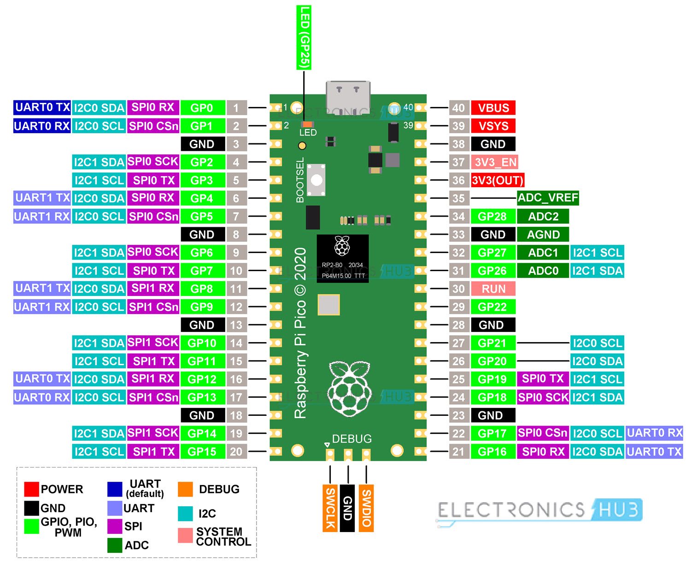

### What?

We present a portable, efficient, passive, consensus based (relative) time
synchronization mechanism over radio waves.

We demonstrate the portability of this mechanism on a bunch of common computing
platforms:

- AMD64 PCs

- Raspberry Pi(s)

- Android phones

- Raspberry Pi Pico (Yep!)


### Why?

FT8, WSPR, and other digital modes need the receivers and the transmitters to
be synchronized in time.

What if there is no external and reliable reference available for time
synchronization?

- RTC clocks can drift over time.

- GPS system can be jammed.

  In comparison, a passive receiver system (i.e. our system) operating over a
  wide range of amateur radio frequencies may be a bit harder to jam.

- Internet may NOT be available in remote areas.

- Sundials can be cumbersome to deploy, calibrate, and perhaps not accurate
  enough ;)

Problem Statement: How do we ensure that we are still able to communicate over
amateur bands using time-synchronized digital modes in absence of external and
reliable references of time?


### How?

Initially, we don't know the (relative) time. We try to decode FT8 traffic with
a timing `fudge factor` of 0. If we don't succeed to decode any traffic, this
`fudge factor` is incremented. This process is repeated until we are able to
decode FT8 traffic successfully. The final value of the `fudge factor` gives
us the (relative) time offset we need.


### Hardware

We use Si4732-A10 IC for HF SSB reception. The Si5351 module provides a clock
output to this Si4732-A10 IC. The other outputs of the Si5351 module can be
used to implement a transmitter.

Thus the whole system is actually a low cost, portable, and efficient digital
transceiver!

The whole system is beginner friendly, and can be built easily on a breadboard
in under an hour or so.

The Si4732-A10 IC is fairly easy to solder on a SMD-To-DIP adapter PCB - no
need to worry about it ;)

For a low-cost alternate option to Si4732-A10, checkout the `CD2003` option
included in this repository.

Tip: Use KiCad 7.x for handling these designs.

Update (September 2023): After on-air testing, we recommend building the
`CD2003-BoB-v2` design included in this repository over other designs for HF!
The `CD2003-S-BoB` design works too but BFO frequency tuning seems like a hard,
finicky process.

Update 2 (November 2023): Please use the `CD2003-BoB-Final` version. It has
some minor correctness fixes in it.

Update 3 (March 2024): Please use the `CD2003-BoB-Final-v2` version. It can be
automatically assembled by JLCPCB!

### Pinout

ATTENTION: The Si4732 IC uses 3.3v signaling! Don't attach it to a 5v MCU
without a bi-directional level shifter.

For sample programs, see https://github.com/pu2clr/SI4735/tree/master/examples.

We include a fully-functional FT8 receiver firmware (for Raspberry Pi Pico) in
this repository. It works on 20m (14.074 MHz) by default. To use this firmware,
write `firmware/run_ft8.uf2` to a Raspberry Pi Pico board.


```
#define CAL            15 // Automatic calibration entry
#define SDA_PIN        12 // GP12 on Pico
#define SCL_PIN        13 // GP13 on Pico
#define RESET_PIN      10 // GP10, Si4732 stuff
```

Si5351 module's CLK 0 goes to `RX_OSC` of Si4732. This has the 32.768 kHz clock
on it.

Si5351 module's CLK 2 goes to GP15 (CAL) of Pico. This is used for automatic
calibration of Si5351 module.

Audio output comes from `L` and `R` pins of the Si4732 BoB.




### Action!


### Credits

https://en.wikipedia.org/wiki/Standing_on_the_shoulders_of_giants

- https://github.com/kgoba/ft8_lib - We use this for FT8 decoding

- https://github.com/aa1gd/pico_ft8_xcvr - Godwin demonstrated ft8_lib powered
  FT8 decoding on Pico first!

- Bradshaw Lupton - For suggesting the original idea and pushing me to do it!


### Prior Work

JTSync and JS8Call are capable of doing time synchronization but they are NOT
portable enough and can't run on microcontrollers!


### Future

We are also interested in automatic, microcontroller based (full) time synchronization systems powered by [WWV](https://www.nist.gov/time-distribution/radio-station-wwv/wwv-and-wwvh-digital-time-code-and-broadcast-format) and other time sources.

And of course, we will be using `DT` values from the decoded FT8 traffic to derive a more accurate `fudge factor` soon!


### References

- https://github.com/kholia/wsprd
- https://en.wikipedia.org/wiki/CHU_(radio_station)
- https://en.wikipedia.org/wiki/WWV_(radio_station)
- https://github.com/kgoba/ft8_lib/
- https://github.com/kholia/pico_ft8_xcvr
- https://github.com/aa1gd/pico_ft8_xcvr
