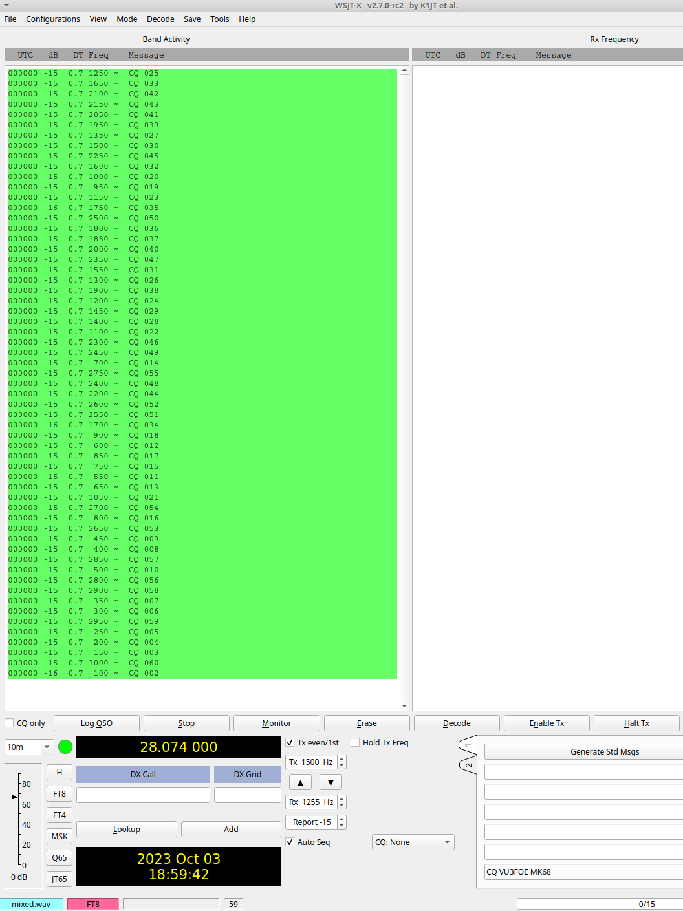
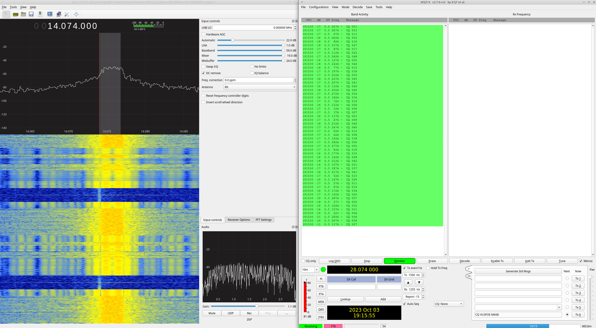

This code generates a .wav file which emulates a fully-populated FT8 band!

This .wav file can then be played with `rpitx` on actual air (well a dummy
load) for receiver testing purposes.




```
rm mixed.wav; sox -m *.wav mixed.wav

sox mixed.wav -r 48000 sampleaudio.wav
```

Now play sampleaudio.wav using https://github.com/F5OEO/rpitx.

I have tested https://github.com/F5OEO/rpitx on Raspberry Pi Zero 2W TX'ing @ 14.074 MHz.
